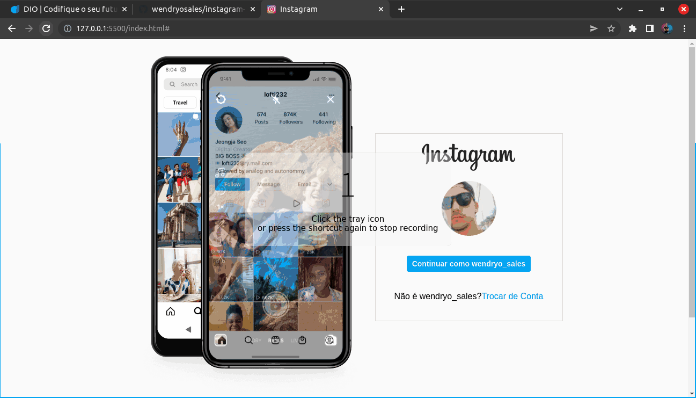
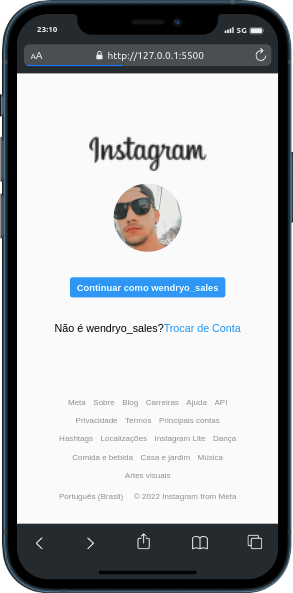

# Página de Login do Instagram

Cópia da página de login do instagram realizada como projeto 
do bootcamp spread-fullstack-developer da @Dio.me


## Stacks

**Front-end:** HTML, CSS.


## Rodando localmente

Clone o projeto

```bash
  git clone git@github.com:wendryosales/instagram-login.git
```

Entre no diretório do projeto

```bash
  cd instagram-login
```

Abra o arquivo Index.html com o seu navegador

## Screenshots

### web


### mobile



## Author

- [@wendryosales](https://www.linkedin.com/in/wendryosales/)
